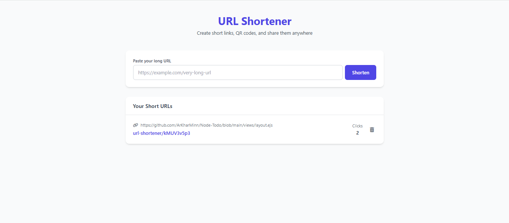

#URL Shortener

A simple URL shortener web application built with Node.js, Express, MongoDB, and EJS.
It allows users to shorten long URLs, track clicks, and manage (delete) shortened links.

Features
Shorten long URLs into short, shareable links

Track the number of clicks per shortened URL

Redirect short URLs to their original destinations

Delete unwanted shortened URLs

Simple and clean UI with Tailwind CSS and Font Awesome icons

Technologies Used
Node.js

Express.js

MongoDB with Mongoose

EJS templating engine

Tailwind CSS for styling

Font Awesome for icons

shortid package for generating short codes

dotenv for environment variable management

Installation
Clone the repository

bash
Copy
Edit
git clone https://github.com/yourusername/url-shortener.git
cd url-shortener
Install dependencies

bash
Copy
Edit
npm install
Create a .env file

Create a .env file in the root directory and add your MongoDB connection string:

env
Copy
Edit
MONGODB_URI=mongodb://localhost:27017/url-shortener
PORT=3000
Run the application

bash
Copy
Edit
npm start
The server will start at http://localhost:3000

Usage
Open your browser and go to http://localhost:3000

Enter a long URL and click Shorten

Your shortened URLs will be listed below with click counts

Click the shortened URL to be redirected

Use the trash icon to delete any shortened URL

Folder Structure
.
├── controllers
│   └── urlController.js
├── models
│   └── url.js
├── routes
│   └── web.js
├── views
│   └── index.ejs
├── app.js
├── package.json

